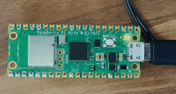
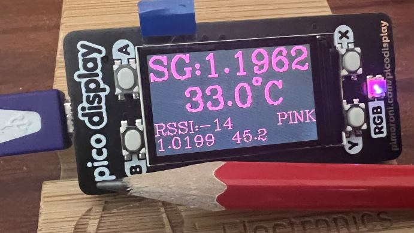
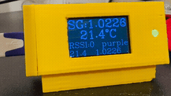
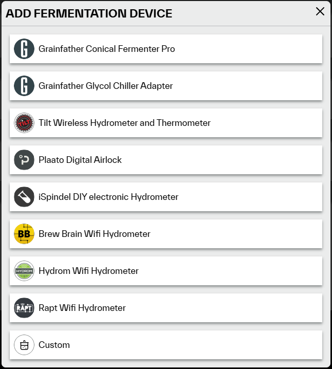

# Micro Bridge (Tilt Hydrometer tool)

This project was originally a fork of [Tilt-Pitch](https://github.com/linjmeyer/tilt-pitch/). It is a remodelling of the work already done in that project. Tilt-Pitch is written in Python. This project aims to convert functionality to MicroPython.

The intention is to create a minimal hardware Bluetooth -> wifi bridge, this project has been developed using a Raspberry Pi Pico W. Requirements;

* Raspberry Pi Pico 2 W (RP2350, wifi and bluetooth)
* micro USB cable
* Thonny software
* UF2 release from this project

Since adding the option to use a display this project has had limited testing on the slightly older Pi Pico W (RP2040, wifi and bluetooth). Although it will run, the RP2040 microcontroller version of the Pico has less SRAM (264KB of SRAM vs 520KB) and flash storage (2MB of on-board flash memory vs. 4MB) than the newer RP2350. The price difference is minimal. UF2 files are available for both versions, using a Raspberry Pi Pico 2 W is recommended.

My personal interest is in getting this to work with the Grainfather system and website, then to get some averaging of values: the Tilt seems to transmit very regularly (as in every second), Grainfather allows logging every 15 minutes (which seems reasonable). Rather than log one potentially noisy value every 15 minutes, store the latest n minutes of data in a circular buffer, when a timer has elapsed do some normalisation and/or averaging on that data and log a single, averaged data point. 

Below are some graphics, the first GIF shows the Pico W running with no display - the LED blinks every 3 seconds. The second image shows the addition of a Pico Display, and finally a demo showing the display enclosed in a 3d Printed case.





# Features

The following features are implemented, planned, or will be investigated in the future:

* [x] Get a minimal demonstration working
* [x] Get Grainfather provider working
* [x] Tilt status data saved to log file (JSON)
* [x] Enable averaging
* [x] More robust WiFi check/reconnect - though more can be added in here
* [x] Watchdog/restarts
* [x] Error logging
* [x] Calibrate Tilt readings with known good values
* [x] Build Instructions
* [x] UF2 release
* [x] LCD display
* [ ] visual warning about low storage space

# Installation

More detailed, step by step instructions will be provided...

## Quick Start

Download the UF2 release (https://github.com/jef41/tilt-micro-bridge/releases) for your device - either Raspberry Pi Pico W or Raspberry Pi Pico 2 W.

Hold down the button on the Pico whilst plugging it into a USB port on your computer.

The device should appear as a mass storage device. Drag and drop the downloaded UF2 file onto the device. This file should take a few seconds to copy over. On completion the mass storage device will disappear. The green LED on the Pico should then light up.

Open Thonny, issue Ctrl-F2 (to stop and restart the connection). Thonny should now display a message about execution interrupt and the REPL prompt >>>. At this point you must edit the config.json file using Thonny.

The Thonny window should show some files on the device, at the bottom left of your screen. Double click the config.json file, add content according to the documentation below. Save this (Ctrl-S) file on the root of the Pico as config.json. These [examples of configuration files](/examples/config_json.md) might help as a starting point. The configuration section below details each option.

Perform aa soft reboot (Ctrl-D), the device will restart and you should see some text output from the deivce in the Thonny shell window. If this output looks OK and includes data from configured Tilt devices then the device is configured and may now be unplugged. 

Once configured and in use, the device requires only USB power, it does not necessarily need to be connected to a computer.

<!--
Install an appropriate Micropython distribution onto the microcontroller, [Instructions](https://micropython.org/download/RPI_PICO/)

Using Thonny, copy the contents of the 'bridge' folder from this repository to the root of the device

On the Pico create a config.json file on the root of the device. In that configuration file as a minimum specify wifi credentials, Tilt colour & Grainfather upload URL. 

Using Thonny run the file picoTilt.py (alternativley rename that file to main.py so it autoruns when the deivce is powered).

This version is a working in principle version. It is probably functional, but requires a lot more refinement before it could be considered a stable, working version for release. CIurrently I do not own a Tilt so it has not been tested on hardware.
-->

## Configuration

Custom configurations can be used by creating a file `config.json` in the root directory on the Pico. Values in config.json will override any that are already in place, as shown below.

| Option                       | Purpose                      | Default               | Example               |
| ---------------------------- | ---------------------------- | --------------------- | --------------------- |
|`ssid` (str) | SSID for your wifi newtork | None | [Example config](examples/wifi.md) |
|`password` (str) | password for your wifi newtork | None | [Example config](examples/wifi.md) |
|`country_code` (str) | ISO 3166-1 alpha-2 character country code for wifi | `None` | [Example config](examples/wifi.md) |
|`wifi_check_interval` (int) | Check there is a working internet conenction every n seconds | `3600` | [Example config](examples/wifi.md) |
|`debug_log` (list) | How many kb in each and how many debug backup files to keep | `[20, 1]` |  |
|`display_type` (str) | currently only option is "DISPLAY_PICO_DISPLAY" | None | [Example config](examples/display.md) |
|`display_update_secs` (float) | how frequently to cycle content of display screen | `5` | [Example config](examples/display.md) |
|`lcd_spi_gpio` (dictionary) | GPIO numbered pins for SPI | `{"cs": 17, "dc": 16, "sck": 18, "mosi": 19,"bl": 20}` | [Example config](examples/display.md) |
|`lcd_backlight` (float) | brightness of LCD display | `0.7`| [Example config](examples/display.md) |
|`rgb_led_gpio` (list) | GPIO pins for RGB LED, for PICO_DISPLAY this is [6,7,8] | None | [Example config](examples/display.md) |
|`rgb_brightness` (float) | brightness of RGB LED | `0.05` | [Example config](examples/display.md) |
|`default_averaging_period` (int) |  Average data over this period of seconds, 0 = no averaging, use most recent value that is within log period. Value must be less than log period. This default will be used if no provider averaging period is present | `30` | No example yet |
|`default_temp_unit` (char) |  The deault temperature unit to display, valid values are either `C` or `F`. This default will be used if no provider averaging period is present | `C` | No example yet |
| `temp_range_min` (int) | Minimum temperature (Fahrenheit) for Pitch to consider a Tilt broadcast to be valid. | `32` | [Example config](examples/min_max.md) |
| `temp_range_max` (int) | Maximum temperature (Fahrenheit) for Pitch to consider a Tilt broadcast to be valid. | `212` | [Example config](examples/min_max.md)  |
| `gravity_range_min` (float) | Minimum gravity for Pitch to consider a Tilt broadcast to be valid. | `0.7` | [Example config](examples/min_max.md) |
| `gravity_range_max` (float) | Maximum gravity for Pitch to consider a Tilt broadcast to be valid. | `1.4` | [Example config](examples/min_max.md) |
| `csv_log_period` (int) | log data at intervals of this many seconds | `60` | [Example config](examples/file_csv.md) |
| `csv_bkp_count` (int) | Keep this number of older files | `4` | [Example config](examples/file_csv.md) |
| `csv_log_tilt_colours` (list) | List of colours of Tilt devices to log to a CSV formatted file | None | [Example config](examples/file_csv.md) |
| `csv_log_averaging_period` (int) | Seconds of data to average over | default_averaging_period | [Example config](examples/file_csv.md) |
| `csv_log_temp_unit` (str) | Log temperatures in °C or °F | default_temp_unit | [Example config](examples/file_csv.md) |
| `grainfather_temp_unit` (str) | Temperature unit sent to Grainfather `F` or `C` | `C` | [Example config](examples/grainfather.md) |
| `grainfather_custom_stream_urls` (dict) | Dict of color (key) and URLs (value), seen as a Custom device on Grainfather site | None/empty | [Example config](examples/grainfather.md) |
| `grainfather_tilt_stream_urls` (dict) | Dict of color (key) and URLs (value), as above, but seen as a Tilt Device | None/empty | [Example config](examples/grainfather.md) |
| `grainfather_averaging_period` (int) | Average data over this period of seconds, 0 = no averaging, use most recent value that is within log period. Value must be less than log period.  | default_averaging_period |  [Example config](examples/grainfather.md) |
| `{colour}_name` (str) | Name of your brew, where {colour} is the color of the Tilt (purple, red, etc) | colour (e.g. purple, red, etc) | [Example config](examples/per_tilt.md) |
| `{colour}_original_gravity` (float) | Original gravity of the beer, where {color} is the color of the Tilt (purple, red, etc) | None/empty | [Example config](examples/per_tilt.md) |
| `{colour}_temp_offsets` (list) | Temperature calibration points [See Calibration](#Calibration) | None/empty | [Example config](examples/per_tilt.md) |
| `{colour}_gravity_offsets` (list) | Gravity calibration points [See Calibration](#Calibration)  | None/empty | [Example config](examples/per_tilt.md) |
<!--
| `webhook_urls` (array) | Adds webhook URLs for Tilt status updates | None/empty | [Example config](examples/webhook/pitch.json) |
| `webhook_limit_rate` (int) | Number of webhooks to fire for the limit period (per URL) | 1 | [Example config](examples/webhook/pitch.json) |
| `webhook_limit_period` (int) | Period for rate limiting (in seconds) | 1 | [Example config](examples/webhook/pitch.json) |-->
<!--
| `prometheus_enabled` (bool) | Enable/Disable Prometheus metrics | `true` | No example yet (PRs welcome!) |
| `prometheus_port` (int) | Port number for Prometheus Metrics | `8000` | No example yet (PRs welcome!) |
| `influxdb_hostname` (str) | Hostname for InfluxDB database | None/empty | No example yet (PRs welcome!) |
| `influxdb_port` (int) | Port for InfluxDB database | None/empty | No example yet (PRs welcome!) |
| `influxdb_database` (str) | Name of InfluxDB database | None/empty | No example yet (PRs welcome!) |
| `influxdb_username` (str) | Username for InfluxDB | None/empty | No example yet (PRs welcome!) |
| `influxdb_password` (str) | Password for InfluxDB | None/empty | No example yet (PRs welcome!) |
| `influxdb_batch_size` (int) | Number of events to batch.  Data is not saved to InfluxDB until this threshold is met | `10` | No example yet (PRs welcome!) |
| `influxdb2_url` (str) | URL of InfluxDB 2.0 database | None/empty | `http://localhost:8086` |
| `influxdb2_token` (str) | Token for writing to InfluxDB 2.0 | None/empty | a base64 encoded string |
| `influxdb2_org` (str) | Org for InfluxDB 2.0 database | None/empty | `org_name` |
| `influxdb2_bucket` (str) | Bucket to write data to in InfluxDB 2.0 | None/empty | `bucket_name`
| `influxdb_timeout_seconds` (int) | Timeout of InfluxDB reads/writes | `5` | No example yet (PRs welcome!) |
| `brewfather_custom_stream_url` (str) | URL of Brewfather Custom Stream | None/empty | No example yet (PRs welcome!) |
-->
<!--|
 `brewersfriend_api_key` (str) | API Key for Brewer's Friend | None/empty | No example yet (PRs welcome!) |
| `taplistio_url` (str) | URL of Taplist.io Tilt reporting webhook | None/empty | No example |
| `azure_iot_hub_connectionstring` (str) | Azure IoT Hub Device Connection String | None/empty | [Example config](examples/azure_iot/readme.md) |
| `azure_iot_hub_limit_rate` (int) | Rate limit according to selected IoT Hub tier. | 8000 | [Example config](examples/azure_iot/pitch.json) |
| `azure_iot_hub_limit_period` (int) | Period during which to observe rate limit, defaults to one day. | 86400 | [Example config](examples/azure_iot/pitch.json) |
-->
<!---
## Rate Limiting and Batching

A single Tilt can emit several events per second.  To avoid overloading integrations with data events are queued with a max queue size set via the `queue_size`
configuration parameter.  If new events are broadcast from a Tilt and the queue is full, they are ignored.  Events are removed from the queue once all enabled
providers have handled the event.  Additionally some providers may implement their own queueing or rate limiting.  InfluxDB for example waits until a certain
queue size is met before sending a batch of events, and the Brewfather and Grainfather integrations will only send updates every fifteen minutes.

Refer to the above configuration and the integration list below for details on how this works for different integrations.
-->
## Calibration

The broadcast temperature and gravity readings from the Tilt device may be adjusted by linear interpolation, using the same method as the Tilt2 App.

You may calibrate gravity for each Tilt by colour.  At the moment, to apply and test calibration points you will need to run the device while connected to Thonny or other serial connection to observe the data. Alternatively set the config.json to use File CSV logging and run the device for a few minutes in each solution, then connect the device to Thonny and look in the CSV files for data. It is suggested to calibrate for temperature first - allowing 15 minutes for the temperature to stabilise. Then place the Tilt in known gravity solutions that are at a stable, room temperature, i.e. about 20°C. Gather all the temperature calibration points, then apply them to teh config.json, then repeat a similar process for the gravity calibration.

With the bridge running it will show uncalibrated values for the first hour, printed to the debug.log file and to a serial terminal as they are received.

Example output:

```
    data: blue SG:1.0246 72.41°F
```

Once the value is stable, write down this uncalibrated value and repeat the process with the next solution. 

### Temperature

The Tilt takes about 15 minutes to equilibrate with the temperature of a solution. You will need locations where you can maintain a solution at a stable temperature for at elast this amount of time. Insert the Tilt into a liquid at a stable temperature, wait for it to equilibrate then make a note of the Tilt reading and the solution temperature. Repeat as required at different temperature points. Once you have the required readings, enter the values into the config.json, using the colour of the Tilt, e.g.:

```
    "blue_temp_offsets" : [ "C", [4.8,5.0], [49.3,50.0] ],
```

Note the first list entry identifies the units used for calibration - in this case celsius. In subsequent pairs, the first reading is that received from the Tilt, the second is the known temperature of the liquid.

### Gravity

Insert the Tilt into solutions of known gravity, e.g. 1.000, 1.060, 1.100, leaving the device to settle in each. 

Add the uncalibrated values and their associated calibration points to the config file, using the correct colour code for the Tilt, e.g.:

```
    "blue_gravity_offsets" : [ [1.005,1.000], [1.090,1.100], [1.060,1.060] ],
```

**Note** that for each pair, the first value is the (uncalibrated) reading from the debug messages, the second value is the calibration point.

The example above shows the Tilt was reading 1.005 in pure water.

As per the Tilt instructions it is suggested that you have at least 2 calibration points, 1.000 & 1.200. Futher points may be added as you see fit.

These calibration points are not stored on the Tilt, but in the Pico. This is also true of the Tilt2 App and the TiltPi setup. You can therefore alternatively use, say the Tilt2 App to view the uncalibrated readings.


## Running without a Tilt

If you want to run tilt-mico-bridge for development, or without a Tilt you can use the `SIMULATE_BEACONS` flag to create fake beacon events instead of scanning for Tilt events via Bluetooth.  Edit main.py to set simulate_beacons to `True` or `False`. The default is False (i.e. listen for iBeacon Bluetooth transmissions). There is also a debug level that may be set. These are declared in the first few lines of main.py

```
DEBUG_LEVEL = logging.INFO
SIMULATE_BEACONS = False
```

# Status LED

The Pico board has an onbaord LED. This is used to give a basic visual indication of the condittion of the code. The table below should help to interpret the LED status;


| Condition                     | Appearance                 | Timing (on/off) milliseconds           | Indication                |
| ---------------------------- | ---------------------------- | --------------------- | --------------------- |
|STARTUP | solid ON | None | The Pico is in its initial startup state, loading variables etc. It should progress within 1 second to initiate a wifi connection |
|CONNECTING | fast blink (on-off ~ twice per second) | 10, 400 | Initial configuration loaded, connecting to wifi |
|CONNECTED | 1Hz blink brief | 200, 800 | The Pico has connected to wifi. It willl progress from this state once a stable wifi connection has been established |
|NOT CONNECTED | 1Hz blink slow | 800, 200 | A wifi connection has not been established. If not using wifi (i.e. logging locally to file) this will not be a problem |
|RUNNING | blink once per 3 secs | 10, 3,000 | The application is running and listenting for data from Tilt devices |

If the LED remains solidly lit this indicates that the Pico has encountered an error. It is most likely that either the config.json file is not present, or this file is invalid. In this situation, use Thonny to connect to the device, inspect the debug.log file and correct the issue.

# Integrations

* [&nbsp; ] [Prometheus](#Prometheus-Metrics)
* [&nbsp; ] [InfluxDb](#InfluxDB-Metrics)
* [&nbsp;  ] [Webhook](#Webhook)
* [x] [CSV Log File](#CSV-Log-File)
* [&nbsp;  ] [Brewfather](#Brewfather)
* [&nbsp;  ] [Brewer's Friend](#BrewersFriend)
* [x] [Grainfather](#Grainfather)
* [&nbsp;  ] [Taplist.io](#taplistio)
* [&nbsp;  ] [Azure IoT Hub](#Azure-IoT-Hub)

Don't see one you want, send a PR 

<!--implementing [CloudProviderBase](https://github.com/linjmeyer/tilt-pitch/blob/master/pitch/abstractions/cloud_provider.py)

## Prometheus Metrics

Prometheus metrics are hosted on port 8000 by default.  No rate limiting or batching is used for Prometheus.  

For each Tilt the followed Prometheus metrics are created:

```
# HELP pitch_beacons_received_total Number of beacons received
# TYPE pitch_beacons_received_total counter
pitch_beacons_received_total{name="Pumpkin Ale", color="purple"} 3321.0

# HELP pitch_temperature_fahrenheit Temperature in fahrenheit
# TYPE pitch_temperature_fahrenheit gauge
pitch_temperature_fahrenheit{name="Pumpkin Ale", color="purple"} 69.0

# HELP pitch_temperature_celcius Temperature in celcius
# TYPE pitch_temperature_celcius gauge
pitch_temperature_celcius{name="Pumpkin Ale", color="purple"} 21.0

# HELP pitch_gravity Gravity of the beer
# TYPE pitch_gravity gauge
pitch_gravity{name="Pumpkin Ale", color="purple"} 1.035

# HELP pitch_alcohol_by_volume ABV of the beer
# TYPE pitch_alcohol_by_volume gauge
pitch_alcohol_by_volume{name="Pumpkin Ale", color="purple"} 5.63

# HELP pitch_apparent_attenuation Apparent attenuation of the beer
# TYPE pitch_apparent_attenuation gauge
pitch_apparent_attenuation{name="Pumpkin Ale", color="purple"} 32.32
```

## Webhook

Unlimited webhooks URLs can be configured using the config option `webhook_urls`.  Webhooks are rate limited per URL and per Tilt, the rate limit is configurable.

Webhooks are sent as HTTP POST with the following json payload:

```
{
    "name": "Pumpkin Ale",
    "color": "purple",
    "temp_fahrenheit": 69,
    "temp_celsius": 21,
    "gravity": 1.035,
    "alcohol_by_volume": 5.63,
    "apparent_attenuation": 32.32
}
```
-->
## CSV Log File

Tilt status broadcast events can be logged to a .csv file using the config option `csv_log_tilt_colours`.  Enter a list of Tilt colours to listen for, e.g. `["red']` to log only Red Tilt data to CSV. Example file:

```
2025-02-19 16:40:24, Simulated Tilt, Festbier logger added
2025-02-19 16:40:34, header, Simulated Tilt for Festbier:
timestamp, ABV (%), Apparent Attenuation (%), Temperature (°C), Specific Gravity
2025-02-19 16:40:34, 5.71, 77.04, 21.9, 1.0259
2025-02-19 16:41:04, 6.28, 85.10, 22.5, 1.0216
2025-02-19 16:41:34, 6.37, 86.41, 22.5, 1.0209
2025-02-19 16:42:04, 6.76, 92.03, 22.2, 1.0179
```

The data logged are;
* Timestamp
* Tilt colour
* Beer name
* ABV
* Apparent Attenuation
* Temperature (°C or °F as specified)
* SG 

The log file name will be `{colour}.csv`. If beer name is included in the config file then the file will be named after the beer name.

If original gravity for the beer is not detailed in the config file then ABV and apparent attenuation will not be present.

When ABV is calculated, the calculation is the longer formula. This is more accurate at higher ABV values than the shorter formula (which is used by the Tilt2 App).

#### 'Quick' ABV Formula:

ABV = (OG – FG) * 131.25

#### More accurate ABV Formula:

ABV = (76.08 * (OG - FG) / (1.775 - OG)) * (FG / 0.794)

**Note** The Pico has limited flash storage, some of which is used for the program files. RP2350 &amp; RP2040 devices are available with more flash storage, but if using CSV logging it is recommended to remove old files before starting a new logging session. Old files with the same name will be overwritten. See [the CSV File examples](examples/file_csv.md) for more detail.

<!--
## InfluxDB Metrics

Metrics can be sent to an InfluxDB database.  See [Configuration section](#Configuration) for setting this up.  Pitch does not create the database
so it must be created before using Pitch.  Tilt events are sent to InfluxDB in batches, data is not sent until the batch size is reached.  The batch size
does not take color into account, so a batch of 50 purple events works the same as 25 purple and 25 red.

Each beacon event from a Tilt will create a measurement like this:

```json
{
    "measurement": "tilt",
    "tags": {
        "name": "Pumpkin Ale",
        "color": "purple"
    },
    "fields": {
        "temp_fahrenheit": 70,
        "temp_celsius": 21,
        "gravity": 1.035,
        "alcohol_by_volume": 5.63,
        "apparent_attenuation": 32.32
    }
}
```  

and can be queried with something like:

```sql
SELECT mean("gravity") AS "mean_gravity" FROM "pitch"."autogen"."tilt" WHERE time > :dashboardTime: AND time < :upperDashboardTime: AND "name"='Pumpkin Ale' GROUP BY time(:interval:) FILL(previous)
```

## InfluxDB 2.0 Metrics

Metrics can be sent to an InfluxDB 2.0 database. See [Configuration section](#Configuration) for details on setting it up.  Pitch does not create the bucket.
This integration uses the same batching logic, output format, and configuration as the 1.0 integration above.

Shared configuration values:
- `influxdb_timeout`
- `influxdb_batch_size`

## Brewfather

Tilt data can be logged to Brewfather using their Custom Log Stream feature.  See [Configuration section](#Configuration) for setting this up in the Pitch config.  Brewfather
only allows logging data every fifteen minutes per Tilt which Pitch adheres to.  Devices will show as `PitchTilt{color}`.

To setup login into Brewfather > Settings > PowerUps > Enable Custom Stream > Copy the URL into your Pitch config


-->
## Grainfather

Tilt data can be logged to Grainfather using their Custom Fermenation Device feature.  See [Configuration section](#Configuration) for setting this up in the file config.json.  Grainfather only allows logging data every fifteen minutes per Tilt, which micro-bridge adheres to.  You must create a custom device per Tilt and save each URL into the micro-bridge config.

Tilt data can alternatively be logged to Grainfather using their **Tilt** Fermentation Device feature.  The set up is the same as per the Custom device, the only difference being whether Grainfather displays your device as a *Custom* or a *Tilt* device.

Note that temperatures displayed on the Grainfather website will use the preference you have configured on their website. This means whether you configure micro-bridge to upload data in Farenheit or Centigrade, the temperature will be converted by the Grainfather website and displayed in your preference configured there. i.e. the Tilt hydrometer natively uses Farenheit, if you want to see temperature data displayed in Centigrade, then change your configuration on the Grainfather website.

To setup, first log in into Grainfather then go to the section My Equipment. Click Add Fermenation Device.



Select either the **Custom** or **Tilt Wireless Hydrometer and Thermometer** option. Set the name for a Custom device, or select the colour if you used the Tilt option. Save. Now click the "i" (info) button next to the device and copy this URL into pitch.config. See [the Grainfather Provider examples](examples/grainfather.md) for more detail.

## Program Flow

At startup the device will look for a file named main.py on the root of the device. If not found, this file will be created and populated. It will then look for config.json, if not found a generic (but invalid) config.json will be created.

The software will then start from main.py and will look for and validate config.json, this must be located in the root folder of the file system on the device. If the configuration file is invalid the device will halt.

Once the configuration has loaded the Pico will look to see if wifi credentials have been specified. If they have been specified then the device will try to connect to the network. If no wifi credentials are present the device will disable all but the CSV file provider, then continue.

The Tilts and providers detailed in config.json will be provisioned (though if no wifi is present all but CSV file provider will be ignored).

The Pico will start to listen for Tilt devices using Bluetooth. As data is received it will be stored on a queue of data points. 

At the specified upload intervals data will be retrieved from the queue. Averaging, calibration and conversion will then be applied as specified from the configuration, and a value stored or uploaded to the provider(s).

If the Pico is plugged in to a USB port on a computer you may use either Thonny, MicroPythions mpremote or a serial terminal (e.g. Putty) to observe messages from the Pico. In its default state received Tilt data will be displayed for the first hour - this is intended to help the calibration process.

In a normal running state the built in LED on the Pico board will blink approximately every 3 seconds to indicate that the device is operating correctly. If an LCD display is present and configured, the display will cycle between configured Tilt devices and a clock display.

## Developing

The UF2 release contains all the necessary code, pre-compiled into .mpy and frozen (hidden) into the UF2. If you wish to develop/play/test things it is suggested that you manually copy the whole folder and contents **/bridge/lib** to the root of the Pico filesystem. This will result in reduced filespace for CSV files, but allows for development and testing. 

It is worth noting that the UF2 release will automatically (re)create main.py if it is not present. To disable this autorun file, rename `main.py` to, for example `tilt-micro-bridge.py` then create a new `main.py` that contains:

```
print("new main, done.")
```

More information on drag and drop setup and links to standard releases are available on the [Raspberry Pi website](https://www.raspberrypi.com/documentation/microcontrollers/micropython.html#drag-and-drop-micropython)

<!---


## Brewer's Friend

Tilt data can be logged to Brewer's Friend using their Custom App Stream feature.  See [Configuration section](#Configuration) for setting this up in the Pitch config.  Brewer's Friend
only allows logging data every fifteen minutes per Tilt which Pitch adheres to.  Devices will show as `Pitch-Tilt-{color}` as custom devices (they will not appear as Tilts).

To setup login into Brewer's Friend > Profile > Integrations > Copy Api Key


## Taplist.io

Tilt data can be logged to [Taplist.io](https://taplist.io/) using the Tilt Integration feature.

To setup, log into Taplist.io and visit _Account_ > _Integrations_ > _Tilt Hydrometer_. Copy the _Webhook URL_ value into your Pitch config as `taplistio_url`.

## Azure IoT Hub

Tilt data can be logged as IoT telemetry to Azure IoT hub and processed
by a variety of services like Event Hubs, Stream Analytics and Power BI.

To set up, follow the instructions at [Microsoft Learn](https://learn.microsoft.com/en-us/azure/iot-hub/iot-hub-create-through-portal)
to configure the IoT hub and create a new device to receive your Tilt's measurements.

# Examples

See the examples directory for:

* InfluxDB Grafana Dashboard
* Running Pitch as a systemd service
* pitch.json configuration file

# Other
-->
## Buy me a coffee (beer)


If you like TiltMicroBridge, feel free to buy me a coffee (or a beer) here: https://www.buymeacoffee.com/jef41
<!--
## Name

It's an unofficial tradition to name tech projects using nautical terms.  Pitch is a term used to describe the tilting/movement of a ship at sea.  Given pitching is also a brewing term, it seemed like a good fit.
-->
