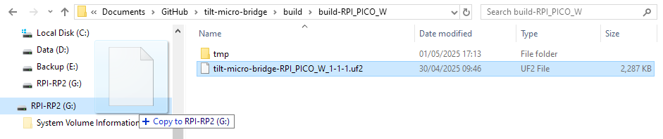
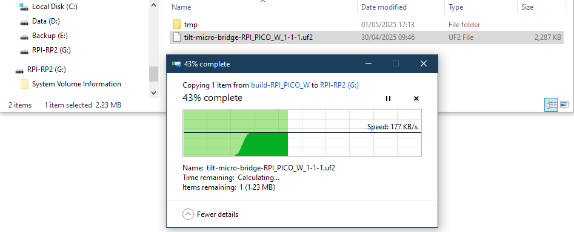
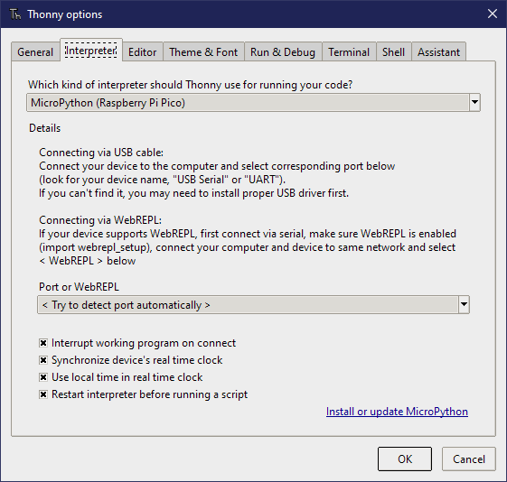
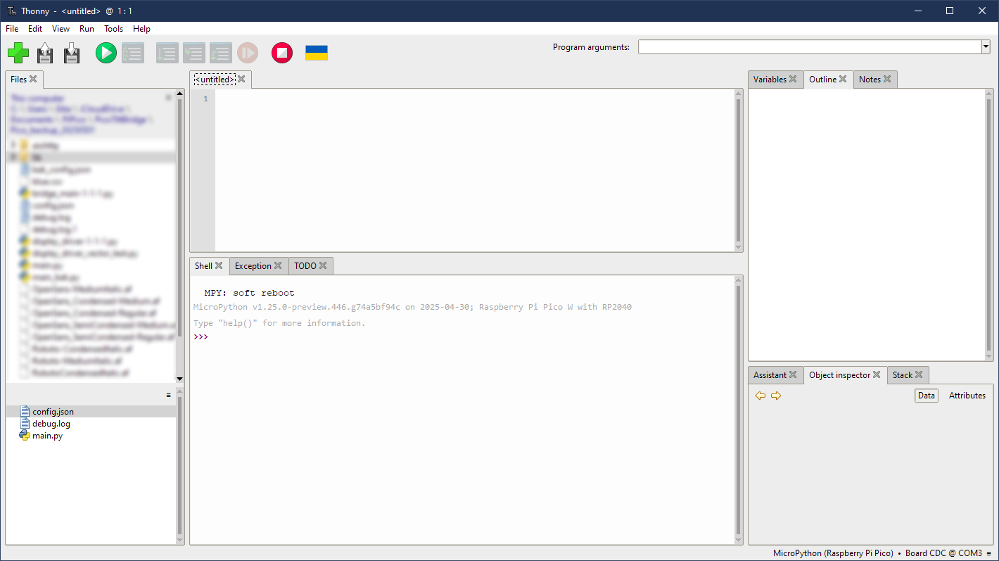
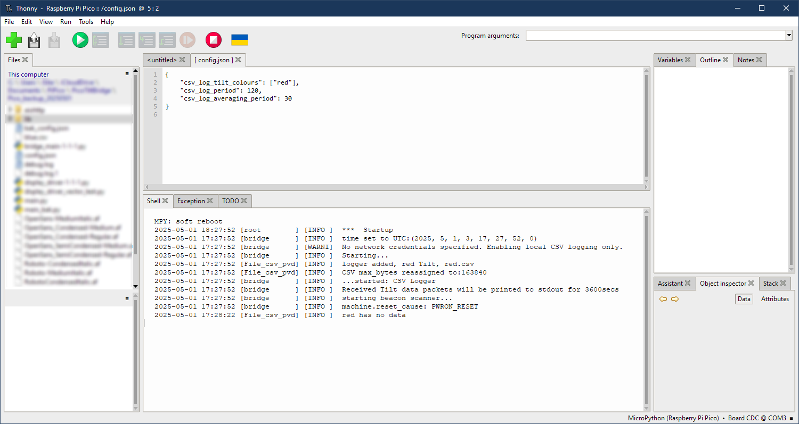

# Comprehensive Guide

This guide aims to provide more comprehensive instructions, for all levels of experience and assuming at least some of the audience may have less familiarity with microcontrollers. 

# 0. Table of Contents
1. [Purchase a board](./comp_guide.md#purchase-a-board)
2. [Installing firmware](./comp_guide.md#installing-firmware)
3. [Install and Configure Thonny](./comp_guide.md#install-and-configure-thonny)
4. [Configuration](./comp_guide.md#configuration)
5. [Test and Run](./comp_guide.md#test-and-run)

<!--## What is a microcontroller
Microcontrollers are a nebulous descriptor of a range of microprocessor boards. The device that you are using to read this may have a main processor or CPU. Typically processors used in desktop computers or smartphones are expensive, complicated, fast and capable of doing lots of things at the same time. This design allows you to use a device for multiple purposes or applications, gaming one minute, then some computing intensive calculations the next, then browse the web, watch a video, basically they can be incredibly versatile. For this versatility there is typically an operating system that allows different applications to use various differrent parts of the processor. 

A microcontroller is simply a constrained, less resource hungry computer. A desktop computer might have 8 processing cores and run 3 billion operations per second (3GHz). The Pico has 2 cores (though only one is used here) and operates at 125MHz. A desktop computer may have 8GB or RAM, this Pico has 264kB. There is less code space, the processor knows fewer commands and has fewer resources. Consequently a microcontroller typically does not have an operating system and multiple applications, but a single firmware image which defines precisely how the device operates and communicates with other components on the same PCB.

Once the firmware is developed, a microcontroller based device is usually smaller, cheaper to manufacture & run and arguably more reliable than a larger processor.

## Choosing the correct board
The Raspberry Pi foundation started by manufacturing single board computers, with the intention of getting more people interested in the physical, plug stuff in and try it side of computing. Those devices have ports for USB, HDMI, audio. In 2021 the Raspbrry Pi foundation released the RP2040 microcontroller. They helpfully stuck the RP2040 on a PCB along with some other basic, but handy hardware so you can easily start playing with the RP2040 without needing any reflow soldering skills. This is the Raspberry Pi Pico family. For the price it is an impressive board, it has a micro USB connection. More recently the RP2350 microprocessor was released, this is a more capable device than its RP2040 predecessor. Crucially there are Pico boards that incorporate a dual wifi and Bluetooth chip that is necessary for this project.

There are many variants of micocontroller boards based on the RP2040 & RP2350, sold by many manufacturers, some have more flash storage, or connectivity options. Some incorporate the name Pico, which is confusing. The firmware developed here is specifically for the *Raspberry Pi Pico W* or the *Raspberry Pi Pico 2 W*. If you have a different board, even if it has the same microprocessor, then the firmware images here are not likely to work. There is a handy reference to where to purchase the Pico boards at the following link; https://www.raspberrypi.com/products/raspberry-pi-pico-2/. Make sure you look for the W option that has a Wifi controller on board. There is nothing wrong with the other boards produced by companies like Pimoroni for example, but the firmware here is specifically for the Raspberry Pi Pico board. You may be able to get get a cheaper copy of the Pico board from elsewhere, on both a moral and user experience basis I suggest you stick with the very good value ones from the genuine resellers suggested in the link above.

The *Raspberry Pi Pico 2 W* is the recommended board.

If you have any intention of maybe at some point adding a display, then I would suggest purchasing one with the header pins already soldered in. To save time soldering 40 pins and because the pins tend to be lower profile on the solder side, which makes fitting into a case easier. -->

## Purchase a board
The Raspberry Pi foundation started by manufacturing single board computers, more recently they started producing their own microcontroller devices. Initially the RP2040 subsequently the RP2350. These are available, integrated into PCBs with additional circuitry and micro USB connection such that you can start programming them at a low cost and without needing to do any of the PCB design and build work. These PCBs are sold as **Rapsberry Pi Pico** boards. The newer RP2350 chip is preferable - it has more RAM and flash storage space. There are a few variants of the Pico boards; using the RP2040or the RP2350, with and without wifi & with or without headers pre-soldered, these are all detailed on the [Raspberry Pi website](https://www.raspberrypi.com/documentation/microcontrollers/pico-series.html). It is essential that the baord you use has a wifi chip (these also provide the Bluetooth interface).

To find resellers in your region follow this link; <br>
https://www.raspberrypi.com/products/raspberry-pi-pico-2/?variant=pico-2-w <br>
I suggest you purcahse a Raspberry Pi Pico 2 W. If you intend to eventually add a little LCD to the Pico then ideally check if the reseller sells a version of this board with header pins already soldered. 

## Installing firmware
The firmware is a compiled, machine code instruction set that determines how the microcontroller operates. In this instance the firmware is a file of approx. 2MB that has the file ending UF2. The UF2 files available from this repository contain all the code that is required to operate. Behidn the scenes this consists of a MicroPython interpreter and some additional libraries. 

* Download the UF2 from this [GitHub repository](https://github.com/jef41/tilt-micro-bridge/releases)
* The Pico has a single white button, labelled _BOOTSEL_, hold this down and plug the Pico board into a computer using a micro USB cable
* The Pico will appear as a mass storage device; either RP2 or RP2350 depending on whether the board ahas a RP2040 or a RP2350 chip
* Drag and drop the UF2 onto the device that appeared when you plugged in the Pico
* The file should take a few seconds to copy over after which the device should reboot and the RP2/RP2350 device should disappear from your system

At this point the software has been successfully copied onto the Pico. Your configuration options should now be added. The 2 images below show an example, drag and dropping the firmware for a RP2040 Pico board, taken from an old Windows build;

 <br>

drag the UF2 file from your download location and onto the Pico device, the file copy progress should display;

 <br>
If this does not work, or if you wish to install an update or change the firmware, then unplug the Pico, hold down the small button labelled _BOOTSEL_, then plug the micro USB connector in, and the Pico should appear as a mass storage device again.

## Install and Configure Thonny
Once the firmware has been applied, some open source software called Thonny is the most straightforward way to configure your Pico device. Download Thonny from: <br>
https://thonny.org

* On first run in Thonny, go to Run > Configure Interpreter, and under the option "Which kind of interpreter should Thonny use.." select **MicroPython (Raspberry Pi Pico)** <br>
 <br>
* Now ensure the Pico board is connected via USB cable (no need to hold odwn the BOOTSEL button any more)
* Click on the red button under Run > Stop/Restart backend, or type CTL+F2
* You should see a layout similar to the image below, where the files _main.py_, _debug.log_ and _config.json_ are on the Pico<br>
 <br>
the blurred files are development files on the test computer, ignore those. If the files on the Pico do not show, try clicking the 3 horizontal lines in the bottom left part of the Thonny window, select Refresh.

## Configuration
Using Thonny, double click on the _config.json_ file. The file should open in the main Thonny window where you can edit it. Once edited use the Save button to save the configuration to the Pico device. Then issue Ctl+D to issue a soft reboot and test the configuration 

A valid, but minimal configuiration file looks like this:

```json
{
    "csv_log_tilt_colours": ["red"],
    "csv_log_period": 120,
    "csv_log_averaging_period": 30
}
```
The above would log data from a red Tilt (either standard, Pro mini or Pro) to a csv file. The data would be logged every 2 minutes and each data point would be an average of the readings taken in the 30 seconds preceeding that log interval. The image below shows the output freom Thonny after saving this file and issuing Ctl+D: 

 

The lower section of the Thonny display offers some feedback from the Pico, typical of correct operation. This configutaion is successful, but you can see that after 30 seconds the device reports 'red has no data', i.e. the Pico has not received any data from a Red Tilt, so has nothing to save to a CSV file. 

If you wish to upload to Grainfather then you will need a wifi connection and an endpoint for the data:
```json
{
    "ssid": "yyyyy-xxxxx",
    "password": "ssssssssssssss",
    "country_code": "GB",
    
    "grainfather_tilt_stream_urls": {
        "red": "https://community.grainfather.com/iot/uuu-vvv/tilt",
        "blue": "https://community.grainfather.com/iot/www-xxx/tilt"
    },
    "grainfather_custom_stream_urls": {
        "orange": "https://community.grainfather.com/iot/yyy-zzz/custom"
    }
}
```
In the example above the ssid (name) and password for your wifi network would need to be entered and saved on the Pico. 3 Tilt devices are configured to upload. The only user facing difference between uploading as a tilt or a custom stream is whether or not the Tilt icon is diplayed in the Grainfather interface.

These examples of configuration files from above are [expanded on and described]](/examples/config_json.md) in some more detail and might help as a starting point. The [configuration section](/README.md) on the main page of this repository details each option.

## Test and Run
json is very particular about syntax. After creating your configuration, perhaps use a site like https://jsonlint.com to validate the file has no syntax erros - missing commas or brackets. 

Using Thonny, perform a soft reboot (Ctrl-D), the device will restart and you should see some text output from the deivce in the Thonny shell window. If this output looks OK and includes data from configured Tilt devices then the device is configured and may now be unplugged. Typical output would be some messages about startup then data being received from your configures Tilt device(s). After the averaging period has elapsed (by default 30 seconds) an upload will be attempted to configured provider(s). Note that most providers seem to limit the rate of data uploads to once per 15 minutes, so if you are stopping and restarting the device repeatedly in a short time, the new data will not appear for up to 15 minutes. 

Once configured and in use, the device requires only USB power, it does not necessarily need to be connected to a computer.


## Updating the Configuration
Should you wish, at some point, to change the configuration - perhaps for entering calibration values, use a similar process with THonny as above. Connect the Pico to a computer with a USB cable, then issue Ctl+F2 or click the red button, and the device should reboot and stop at the command prompt. From here you can modify the configuration file as described above, then reboot to test the new setup.

[back to top](./comp_guide.md#0-table-of-contents)

