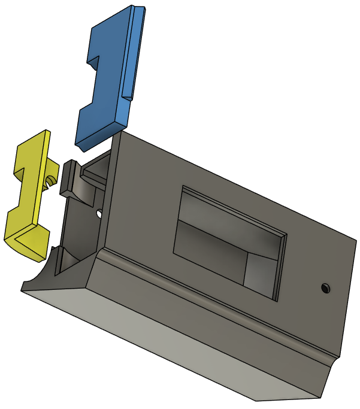
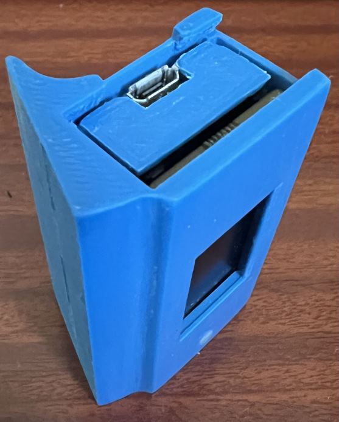

# Case design
The files here are for 3D printing a simple case. 

I suggest purchasing a Pico 2 W  with header pins presoldered. The case is designed for a snug fit, if you have soldered the pins yourself you may need to trim the pins on the soldered side.

The images show how the parts are intended to fit together;

Slide the assembled Pico and display into the case. Internally, the right hand end of the case incorporates a little ramp which will lift the display to meet the front of the case. Once the Pico & display boards are inserted, insert the wedge below the Pico board at the open end of the case, this will lift the left side of the LCD to meet the case. Finally slide the door, which will hold everything in place.

Since I usually place this device on a metal surface, the base contains two recesses into which I dropped a couple of magnets - approximately 10mm diameter and 1mm thick.

When printing you may wish to place the case on one end. In this orientation the only support required is around the window. Placing support blockers around the magnet recesses will significantly reduce the effort required in removing supports after printing.
